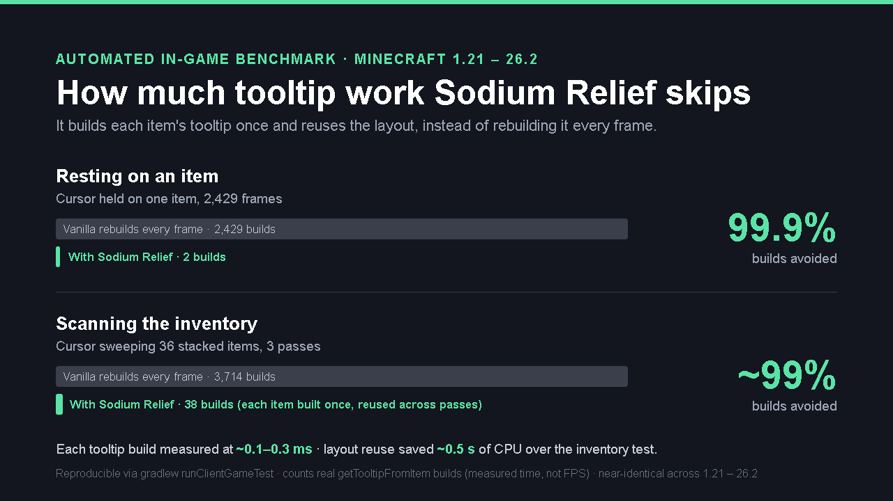
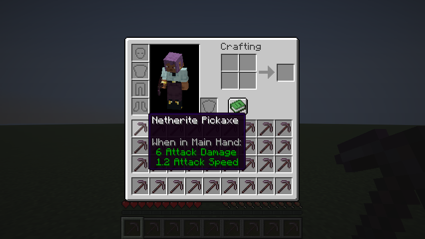

# Sodium Relief

Sodium Relief is a lightweight, client-side companion for Sodium focused on one problem: reducing tooltip and hover stutter on inventory-like screens.

It targets GUI interactions where repeated per-frame work can feel uneven even when overall FPS is already fine — hovering across a chest, scanning an inventory, comparing items.

## What it does

- Reuses already-prepared tooltip layouts while the hovered item is unchanged, instead of rebuilding them every frame.
- Stabilizes hover handling so the same target isn't recomputed redundantly as the cursor settles.
- Caches text width measurements for repeated strings (such as item stack counts drawn on every visible slot).
- Stays out of the way: when in doubt about an item or screen, it falls back to vanilla behavior.

## Scope

Sodium Relief is intentionally narrow.

It is not a replacement for Sodium and not a general FPS mod. It will not raise your framerate in the open world — it smooths the *feel* of tooltip- and hover-heavy GUI usage. If you don't spend time in inventories, you won't notice it, and that's by design.

## Measured impact

The effect is reduced redundant work, not extra frames — so it is measured as tooltip builds avoided rather than FPS. An automated in-game test opens a real inventory screen, hovers items, and counts the **actual `getTooltipFromItem` builds** (the expensive part) instead of rebuilding the tooltip every frame:

| Scenario                          | Tooltip draws | Real builds with Sodium Relief | Avoided |
| --------------------------------- | ------------- | ------------------------------ | ------- |
| Resting on one item               | 2,429         | 2                              | 99.9%   |
| Scanning 36 items (3 passes)      | 3,714         | 38                             | ~99%    |

Each tooltip build was measured in-game at **~0.13 ms** for common items (more for complex ones, ~0.26 ms), so the reuse above avoided roughly **half a second of CPU work** over the ~20-second test — work that would otherwise land as small per-frame hitches while you hover. (These counts are the real `getTooltipFromItem` builds; an earlier version of this table reported a higher number that was actually an internal fingerprint-rebuild counter, not the expensive build itself.)

Numbers are near-identical across Minecraft versions — verified in-game on 1.21.4, 1.21.10, 1.21.11 and 26.1.2. Reproduce them yourself with `gradlew :sodium-relief-mc12110:runClientGameTest` (the client gametest ships in every 1.21.4-and-newer module and the 26.x modules); each run writes a raw counter snapshot — including the measured build time — that you can inspect. A snapshot can be exported in-game at any time from the config screen's *Export Benchmark* button.

*The exact inventory screen the test hovers — captured in-game by the test itself, not staged.*

## Compatibility

Several jars are built from the same shared core, each covering a Minecraft version range:

| Jar                              | Minecraft       | Loader | Java |
| -------------------------------- | --------------- | ------ | ---- |
| `sodiumrelief-mc1211-<ver>.jar`  | 1.21 – 1.21.1   | Fabric | 21   |
| `sodiumrelief-mc1213-<ver>.jar`  | 1.21.2 – 1.21.3 | Fabric | 21   |
| `sodiumrelief-mc1214-<ver>.jar`  | 1.21.4          | Fabric | 21   |
| `sodiumrelief-mc1215-<ver>.jar`  | 1.21.5          | Fabric | 21   |
| `sodiumrelief-mc1218-<ver>.jar`  | 1.21.6 – 1.21.8 | Fabric | 21   |
| `sodiumrelief-mc12110-<ver>.jar` | 1.21.9 – 1.21.10 | Fabric | 21   |
| `sodiumrelief-mc12111-<ver>.jar` | 1.21.11         | Fabric | 21   |
| `sodiumrelief-mc261x-<ver>.jar`  | 26.1.x          | Fabric | 25   |
| `sodiumrelief-mc262x-<ver>.jar`  | 26.2            | Fabric | 25   |

Client-side only. Requires Fabric API. Sodium is recommended but not required. Mod Menu is optional.

## Configuration

Settings can be changed in-game, with no config file editing required:

- through Sodium's options page (1.21.11 only, when Sodium is installed),
- through Mod Menu, or
- through a button added to the vanilla Options screen.

Everything is on by default and safe to leave as-is. Available in English, Russian and Ukrainian.

## Installation

Pick the jar matching your Minecraft version and drop it into your `mods/` folder.

## Disclaimer

Sodium Relief is an unofficial, independent companion mod. It is **not affiliated with, endorsed by, or sponsored by CaffeineMC or the Sodium project**, and it does not include or modify any Sodium code.

Sodium is the work of [CaffeineMC](https://github.com/CaffeineMC). Sodium Relief is simply designed to work well alongside it. All product names, logos, and brands are property of their respective owners.
